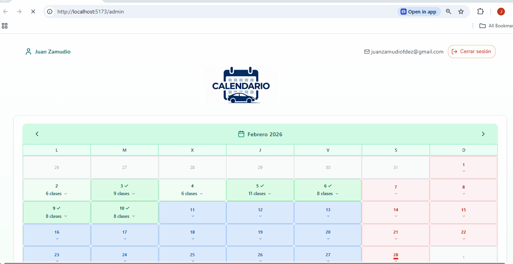

# 🏎️ Driving School App: Management & Analytics for Instructors

This project is a high-performance, real-world management tool specifically engineered to solve the logistical headaches of driving instructors. Currently in production, it enables instructors to move beyond manual tracking and focus on what they do best: teaching.

  

---

## 🌟 The Problem & The Solution
The idea was born from a real daily need: **stopping the "paper-and-pen" chaos.** Most instructors rely on physical notebooks or rigid Excel sheets to count lessons, which leads to errors, lost data, and difficulty in predicting monthly income.

This app replaces those outdated methods with a centralized, mobile-first dashboard that handles all the heavy lifting—from daily lesson counts to complex performance forecasting.

### 🚀 Core Features

* **Effortless Lesson Tracking:** Log each day's sessions with a few taps. The system is context-aware; it knows your specific goals (e.g., **8 lessons for a half-shift** or **13 for a full shift**) and provides immediate visual feedback once you've hit your target.
* **Smart Calendar with Vacation Logic:** Managing a schedule around holidays is usually a nightmare. This calendar comes pre-configured with **Spanish public holidays for 2025 and 2026**. Crucially, it allows you to mark vacation periods so they don't skew your performance statistics or lower your "average" artificially—solving the calculation mess that usually happens during time off.
* **Predictive Analytics Dashboard:** Data is useless if you can't read it. I integrated **Recharts** to visualize:
    * Total lessons per month vs. historical goals.
    * A **rolling 6-month average** to help instructors accurately predict their future income.
    * Monthly growth trends to identify peak busy seasons.
* **Seamless Google Sync:** Using Firebase Authentication, instructors can log in via Google. No new passwords to remember, and every lesson logged on a phone is instantly synced to the cloud, accessible from any device.

---

## 📈 Real-World UX & Mobile-First Strategy
This isn't just a coding exercise; it's a tool optimized for the field. By integrating **Google Analytics**, I discovered that **90% of active users** access the app while sitting in the car between lessons. 

Because of this, I focused heavily on:
* **Thumb-friendly UI:** All buttons and inputs are designed for one-handed use.
* **Performance Charts:** Optimized SVG rendering for mobile screens so data remains crisp and interactive on small displays.
* **Zero Latency:** Firestore's offline persistence ensures that if an instructor is in a low-signal area, the app still works, and data syncs the moment they are back online.

---

## 🛠️ Technical Breakdown ("Under the Hood")
To maintain a production-ready environment, I prioritized type safety and speed:

* **Frontend Framework:** `React 18` + `TypeScript`. Using strict types for the calendar logic and lesson objects ensures that calculating totals across different years and shifts is 100% bug-free.
* **Database & Auth:** `Firebase`. I chose Firestore for its real-time capabilities and effortless scaling.
* **Visualizations:** `Recharts`. It provides the perfect balance between customizability and performance for mobile browsers.
* **Styling:** `Tailwind CSS`. Utilized a mobile-first utility approach to keep the CSS bundle tiny and the UI extremely fast.

---

## ⚙️ Installation & Setup
1. **Clone the repository:** `git clone https://github.com/juanzafe/driving-school-app.git`
2. **Install dependencies:** `npm install`
3. **Environment Variables:** Create a `.env` file with your Firebase configuration.
4. **Run Development Mode:** `npm run dev`

**Developed by Juan Zamudio – Real solutions for everyday professional problems.**